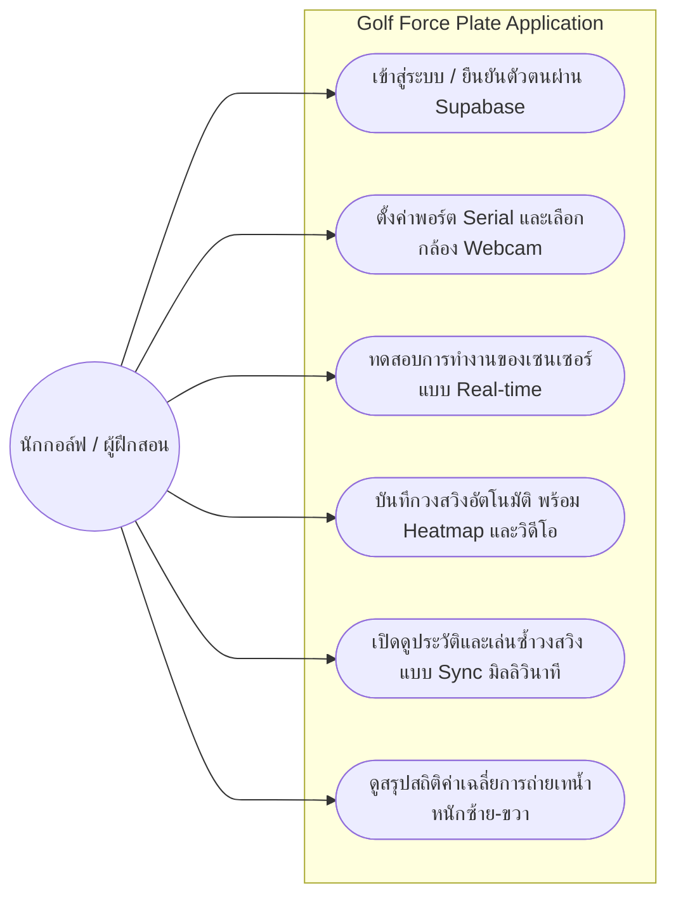
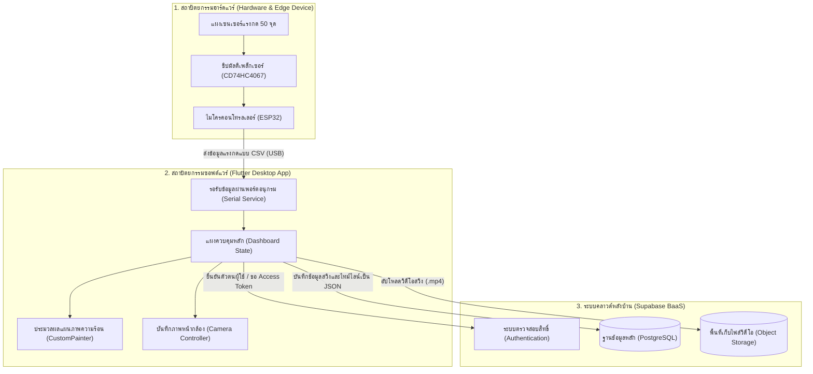
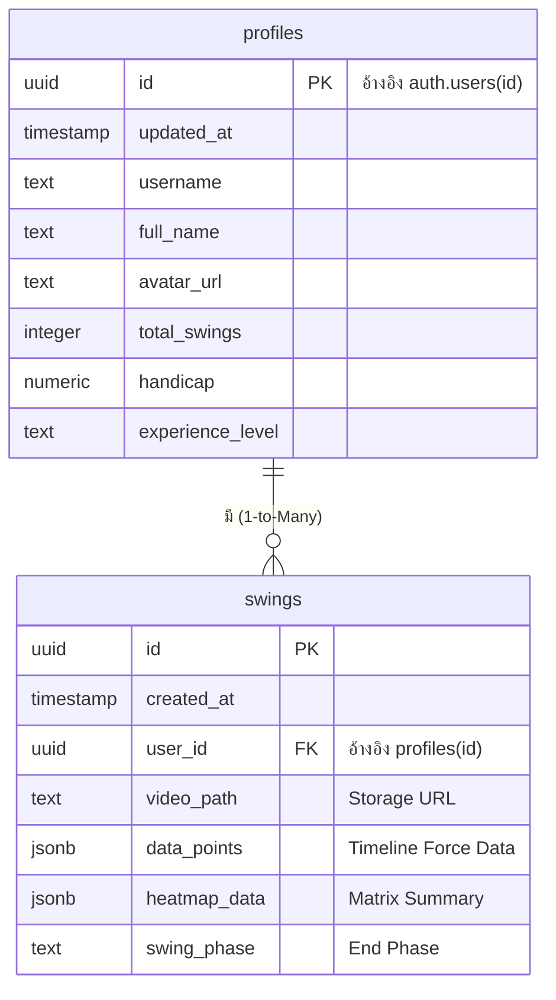
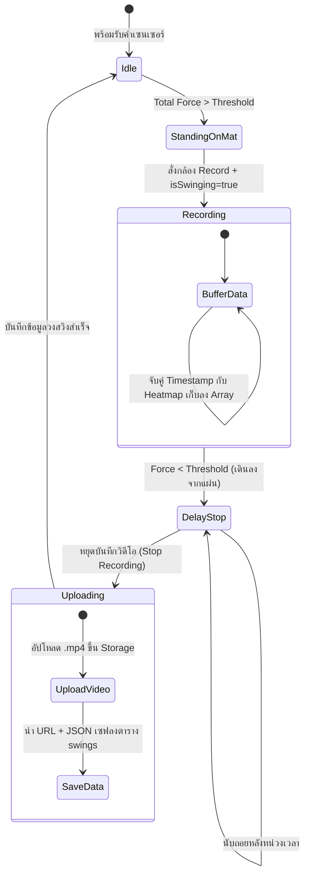

3.6	ภาพรวมสถาปัตยกรรมและแผนภาพการใช้งานระบบ (System Overview and Use Case)
ก่อนเข้าสู่ขั้นตอนการพัฒนาในแต่ละส่วน โครงการนี้ได้ออกแบบภาพรวมสถาปัตยกรรมระบบ (System Architecture) และแผนภาพกระบวนการทำงาน (Use Case Diagram) เพื่อกำหนดขอบเขตและให้เห็นส่วนประกอบที่เชื่อมโยงกันอย่างชัดเจนดังนี้

3.6.1 แผนภาพการใช้งานระบบ (System Use Case Diagram)


3.6.2 แผนภาพสถาปัตยกรรมระบบ (System Architecture)


3.7	การพัฒนาเฟิร์มแวร์และระบบรับส่งข้อมูล (Firmware and Data Acquisition)
การพัฒนาเฟิร์มแวร์เป็นขั้นตอนที่รับผิดชอบด้านฮาร์ดแวร์เพื่อดึงข้อมูลดิบจากเซนเซอร์ (Data Acquisition) โดยมุ่งเน้นการเขียนชุดคำสั่งควบคุมไมโครคอนโทรลเลอร์ ESP32 ให้สแกนค่าสัญญาณจากเซนเซอร์แรงกดทั้ง 50 จุด ประมวลผลเบื้องต้น และส่งข้อมูลออกแบบเรียลไทม์ผ่านพอร์ตอนุกรม (USB Serial) ไปยังแอปพลิเคชันหลักอย่างมีเสถียรภาพและมีความหน่วงแฝง (Latency) ต่ำที่สุด โดยใช้ Arduino IDE เป็นสภาพแวดล้อมในการพัฒนาและทดสอบ
3.7.1	การติดตั้งและกำหนดค่าสภาพแวดล้อม (Environment Setup)
<!-- [แทรกรูปภาพ: หน้าจอโปรแกรม Arduino IDE และแพ็กเกจบอร์ด ESP32] -->
ก่อนเริ่มพัฒนาเฟิร์มแวร์ จำเป็นต้องติดตั้งและกำหนดค่าสภาพแวดล้อมการพัฒนาให้พร้อมใช้งานกับบอร์ด ESP32 โดยเริ่มจากการดาวน์โหลดและติดตั้ง Arduino IDE เวอร์ชันล่าสุดจากเว็บไซต์ทางการ จากนั้นเพิ่ม URL ของ ESP32 Board Package เข้าไปในส่วน Additional Board Manager URLs แล้วติดตั้ง esp32 by Espressif Systems ผ่าน Board Manager เพื่อให้ Arduino IDE รองรับการ Compile และ Upload โปรแกรมไปยังบอร์ด ESP32 ได้
3.7.1.1	การใช้งานไลบรารีที่จำเป็น ในส่วนของการพัฒนาเฟิร์มแวร์สำหรับบอร์ด ESP32 ไม่มีความจำเป็นต้องติดตั้งไลบรารีเพิ่มเติมเป็นพิเศษ เนื่องจากใช้เพียงคำสั่งพื้นฐานของ Arduino ร่วมกับการอ่านค่าสัญญาณแอนะล็อก (Analog Read) และการส่งข้อมูลในรูปแบบสตริงทั่วไป (CSV Format) ผ่านพอร์ตอนุกรม (Serial Communication) ไปยังคอมพิวเตอร์โดยตรง ทำให้ประหยัดทรัพยากรหน่วยความจำของบอร์ดและทำงานได้อย่างรวดเร็วมากยิ่งขึ้น
3.7.1.2	การกำหนดค่าเริ่มต้นของระบบใน setup() กำหนดค่าต่าง ๆ ในฟังก์ชัน setup() ซึ่งทำงานเพียงครั้งเดียวตอนเริ่มต้น ได้แก่ ตั้งค่า Baud Rate ที่ 115,200 บิตต่อวินาที ซึ่งเป็นแบนด์วิดท์ที่เพียงพอสำหรับการส่งข้อมูลจากเซนเซอร์ทั้ง 50 จุดที่ความถี่สูง กำหนดขาควบคุม Multiplexer (S0 ถึง S3) ให้เป็น Output และตั้งค่าความละเอียดของ ADC ไว้ที่ 12 บิต ทำให้สามารถแบ่งสัญญาณได้ 4,096 ระดับ ซึ่งมีความละเอียดเพียงพอสำหรับการวัดแรงกดฝ่าเท้า
3.7.2	การสแกนสัญญาณผ่าน Multiplexer และการกรองข้อมูล  ในฟังก์ชัน loop() ไมโครคอนโทรลเลอร์จะวนสแกนค่าจากเซนเซอร์ทุกจุดอย่างต่อเนื่อง โดยส่งสัญญาณควบคุม 4 บิต (S0 ถึง S3) ไปยังขาควบคุมของ Multiplexer CD74HC4067 แต่ละชุด เพื่อเลือกช่องสัญญาณ
ทีละช่องอย่างรวดเร็ว จนครบทุกช่องของ Multiplexer ทั้ง 4 ชุดที่ใช้ในระบบ
3.7.2.1	การแปลงสัญญาณอนาล็อกเป็นดิจิทัล ข้อมูลอนาล็อกที่อ่านได้จากเซนเซอร์แต่ละจุดจะถูกแปลงเป็นดิจิทัลโดย ADC ขนาด 12 บิตของ ESP32 ให้ได้ค่าในช่วง 0 ถึง 4,095 ซึ่งสัมพันธ์กับแรงดันไฟฟ้าในช่วง 0 ถึง 3.3 โวลต์ ค่าที่อ่านได้จะถูกประมวลผลต่อในขั้นตอนการกรองสัญญาณรบกวน
3.7.2.2	การกรองสัญญาณรบกวนเบื้องต้น (Noise Filtering) นำค่าที่อ่านได้มาผ่านกระบวนการ Threshold Filtering โดยกำหนดค่าขีดแบ่งขั้นต่ำ (Threshold) ไว้ หากค่าแรงกดที่อ่านได้ต่ำกว่าเกณฑ์จะถูกตัดทอนเป็น 0 ทันที วิธีนี้ช่วยลดสัญญาณรบกวน (Sensor Noise) จากสภาพแวดล้อมทางไฟฟ้าไม่ให้ส่งผลต่อการคำนวณสมดุล และลดปริมาณข้อมูลที่ไม่จำเป็นที่ต้องส่งออกผ่าน Serial Port
3.7.3	การจัดรูปแบบและส่งข้อมูลผ่านพอร์ตอนุกรม (Serial Communication)
        หลังจากกรองสัญญาณเสร็จแล้ว ค่าแรงกดทั้ง 50 ถึง 64 ค่าที่อ่านได้ในแต่ละรอบการสแกนจะถูกนำมาจัดเรียงต่อกันเป็นสตริงรูปแบบ CSV คั่นด้วยเครื่องหมายจุลภาค และปิดท้ายด้วยตัวอักษรบอกการขึ้นบรรทัดใหม่ (\n) แล้วส่งออกผ่านคำสั่ง Serial.println() การส่งข้อมูลผ่านสายสัญญาณโดยตรงแทนการใช้ Wi-Fi ในขั้นตอนนี้ช่วยรับประกันว่าข้อมูลแรงกดระหว่างประมวลผลวงสวิงจะไม่มีการสูญหายหรือเกิดความหน่วงจากเครือข่าย ทำให้แอปพลิเคชันฝั่ง Flutter สามารถรอรับและถอดรหัสข้อมูลรายเฟรมได้อย่างแม่นยำ


3.7.3.1	การตรวจสอบความสมบูรณ์ของข้อมูล เพิ่มกลไกตรวจสอบความสมบูรณ์ของข้อมูลในแต่ละเฟรมโดยใช้สัญลักษณ์เริ่มต้นและสิ้นสุดของชุดข้อมูล เพื่อให้ฝั่งแอปพลิเคชันสามารถตรวจพบและกรองเฟรมข้อมูลที่ไม่สมบูรณ์ออกได้ ซึ่งอาจเกิดจากการขาดการเชื่อมต่อชั่วคราวหรือข้อผิดพลาดในการส่งข้อมูล
3.8	การพัฒนาระบบฐานข้อมูลและคลาวด์แบ็กเอนด์ (Backend and Cloud Infrastructure)
<!-- [แทรกรูปภาพ: หน้าจอภาพรวมโปรเจกต์ (Dashboard) ใน Supabase] -->
ส่วนระบบหลังบ้านใช้แพลตฟอร์ม Backend-as-a-Service (BaaS) จาก Supabase ซึ่งขับเคลื่อนด้วยระบบฐานข้อมูล PostgreSQL เพื่อควบคุมการจัดเก็บข้อมูลแบบ Time-series ข้อมูลวิดีโอวงสวิง และข้อมูลผู้ใช้งาน ด้วยระบบรักษาความปลอดภัยประสิทธิภาพสูง โดยเริ่มจากการสร้างโปรเจกต์ใหม่บน Supabase Dashboard กำหนด Region ที่ใกล้เคียงกับผู้ใช้งานเพื่อลด Latency และบันทึก Project URL และ API Key ไว้ในไฟล์ .env เพื่อใช้งานในแอปพลิเคชัน Flutter
3.8.1	โครงสร้างตารางและสคีมา (Database Schema)
ออกแบบฐานข้อมูลให้ประกอบด้วย 2 ตารางหลัก ได้แก่ ตาราง (`)profiles(`) สำหรับเก็บข้อมูลผู้ใช้งาน (เช่น ชื่อ ระดับแฮนดิแคป) และตาราง (`)swings(`) สำหรับเก็บข้อมูลเชิงผสานของแต่ละเซสชันการสวิง โดยตาราง (`)swings(`) ประกอบด้วยคอลัมน์สำคัญ ได้แก่ (`)user_id(`) (อ้างอิงบัญชีผู้ใช้), (`)timestamp(`), (`)data_points(`) (เก็บข้อมูลแรงกดแบบไทม์ไลน์ในรูปแบบ JSONB Array), (`)heatmap_data(`) (ข้อมูลเมทริกซ์ความร้อน), (`)swing_phase(`) (สถานะวงสวิงทอมจบ), และ (`)video_path(`) (ลิงก์ไฟล์วิดีโอจาก Storage)

3.8.1.1	การสร้าง Index เพื่อเพิ่มประสิทธิภาพการค้นหา สร้าง Index บนคอลัมน์ user_id และ created_at ของตาราง swings เพื่อเพิ่มความเร็วในการค้นหาและกรองข้อมูลย้อนหลัง โดยเฉพาะเมื่อข้อมูลสะสมมีปริมาณมาก นอกจากนี้ยังกำหนด Foreign Key Constraint ระหว่างตาราง swings เชื่อมโยงกับตาราง profiles เพื่อรักษาความสมบูรณ์ของข้อมูลเชิงสัมพันธ์
3.8.2	การจัดการ Storage และการซิงก์ไฟล์วิดีโอ
<!-- [แทรกรูปภาพ: หน้าจอจัดการ Bucket "swing-videos" ใน Supabase Storage] -->
        สร้าง Bucket ชื่อ swing-videos ใน Supabase Storage แบบ Object Storage สำหรับเก็บไฟล์วิดีโอ (.mp4) ของแต่ละเซสชันการสวิง เมื่อการบันทึกสวิงเสร็จสิ้น แอปพลิเคชันจะอัปโหลดไฟล์วิดีโอขึ้น Supabase Storage จากนั้นระบบจะคืนค่า Public URL เพื่อให้แอปพลิเคชันนำลิงก์กลับไปอัปเดตลงในตาราง swings ควบคู่กับข้อมูลแรงกด ทำให้สามารถเรียกดูวิดีโอและข้อมูลแรงกดพร้อมกันในหน้าจอ Playback ได้
3.8.2.1	กำหนด Bucket Policy ให้เฉพาะเจ้าของไฟล์เท่านั้นที่สามารถอัปโหลด ดาวน์โหลด และลบไฟล์วิดีโอของตนเองได้ โดยอ้างอิง user_id จาก Supabase Auth เพื่อป้องกันการเข้าถึงไฟล์วิดีโอของผู้ใช้งานคนอื่น
3.8.3	ระบบรักษาความปลอดภัย Row Level Security และ Authentication
พัฒนาระบบยืนยันตัวตน (Authentication) ในแอปพลิเคชันโดยรองรับการทำงานด้วย <!-- Google Sign-In และ --> Email/Password ผ่าน Supabase Auth SDK ฐานข้อมูลมีการเปิดใช้งาน Row Level Security ในระดับ Policy บนทุกตารางและ Storage Bucket ทำให้แอปพลิเคชันต้องแนบตัวแปรระบุผู้ใช้ผ่าน _supabase.auth.currentUser?.id ทุกครั้งในคำสั่งอ่านหรือเขียน ส่งผลให้ระบบจำกัดขอบเขตการมองเห็นข้อมูลอย่างเด็ดขาด เฉพาะเจ้าของข้อมูลเท่านั้นที่สามารถเข้าถึงข้อมูลการฝึกซ้อมของตนเองได้ (Data Isolation)
3.8.3.1	การจัดการ Session Token เมื่อผู้ใช้งานยืนยันตัวตนสำเร็จ Supabase SDK จะสร้าง Session Token อัตโนมัติและเก็บไว้ในหน่วยความจำของแอปพลิเคชัน แอปพลิเคชัน Flutter จัดการการเข้าสู่ระบบผ่าน supabase_flutter Package ซึ่งมีกลไกตรวจสอบสถานะยืดอายุการเชื่อมต่อ (Token Refresh) และแนบ JWT (JSON Web Token) ไปกับ HTTP Header โดยอัตโนมัติในทุก ๆ คำสั่งฐานข้อมูล ช่วยลดข้อผิดพลาดในการตรวจสอบสิทธิ์
3.9	การพัฒนาแอปพลิเคชันและการแสดงผลข้อมูล (Application and Data Visualization)
พัฒนาแอปพลิเคชันหลักด้วย Flutter Framework ให้ทำหน้าที่เป็นศูนย์กลางประมวลผลฝั่งขอบ (Edge Computing Controller) เพื่อรับข้อมูลดิบจาก Serial Port ทำการกรองและประมวลผล แปลงและแสดงผลในรูปแบบกราฟิก Heatmap บนหน้าจอ บันทึกภาพวิดีโอวงสวิง และจัดการสถานะต่าง ๆ ของระบบ โดยใช้ Visual Studio Code เป็นสภาพแวดล้อมหลักในการพัฒนา


3.9.1	การออกแบบส่วนต่อประสานกับผู้ใช้งาน (User Interface Design)
หน้าจอของแอปพลิเคชันถูกออกแบบโดยยึดหลักความเรียบง่ายและใช้งานสะดวก (User-friendly) รองรับการใช้งานของทั้งนักกีฬาและผู้ฝึกสอน โดยก่อนเริ่มพัฒนาโค้ดจริง ผู้พัฒนาได้ออกแบบโครงร่างหน้าจอทั้งหมดผ่านโปรแกรม Figma ซึ่งเป็นเครื่องมือออกแบบ UI/UX แบบ Vector-based ที่รองรับการทำงานร่วมกันแบบ Real-time เพื่อกำหนดโครงสร้างตำแหน่งองค์ประกอบ ระบบสี และรูปแบบตัวอักษรให้ชัดเจนก่อนนำไปพัฒนาจริงใน Flutter
การออกแบบเริ่มจากการร่าง Wireframe ของแต่ละหน้าจอในระดับ Low-fidelity เพื่อกำหนดโครงสร้างและตำแหน่งองค์ประกอบหลักก่อน จากนั้นพัฒนาเป็น High-fidelity Prototype ที่มีสีและรูปแบบตัวอักษรครบถ้วน พร้อมเชื่อมโยงการเปลี่ยนหน้าจอ (Prototype Interaction) เพื่อจำลองการทำงานของแอปพลิเคชันก่อนพัฒนาจริง ทำให้สามารถตรวจสอบความสมเหตุสมผลของ User Flow และปรับแก้ได้ตั้งแต่ขั้นตอนการออกแบบโดยไม่ต้องแก้โค้ด
นอกจากนี้ยังได้กำหนด Design System ใน Figma ประกอบด้วยจานสี (Color Palette) หลักและรอง รูปแบบตัวอักษร (Typography) ที่ใช้ในทุกหน้าจอ และรูปแบบของปุ่มและองค์ประกอบที่ใช้ซ้ำ (Component Library) จากนั้นนำ Design System ดังกล่าวไปกำหนดเป็น ThemeData ในไฟล์ theme.dart ของ Flutter เพื่อให้ทุกหน้าจอมีความสม่ำเสมอ และองค์ประกอบที่ใช้งานร่วมกันหลายหน้าจอถูกพัฒนาเป็น Reusable Widget ในโฟลเดอร์ widgets ตามหลักการ DRY (Don't Repeat Yourself)
จากการออกแบบใน Figma ได้กำหนดโครงสร้างหลักของแอปพลิเคชันออกเป็น 9 หน้าจอหลัก ได้แก่ หน้าต้อนรับ (Splash Screen) หน้าเข้าสู่ระบบ (Login Screen) หน้าสมัครสมาชิก (Register Screen) หน้าโครงสร้างนำทางหลัก (Main Navigation Shell) หน้าแผงควบคุมหลัก (Dashboard Screen) หน้าต่างเชื่อมต่อฮาร์ดแวร์ (Hardware Connection UI) หน้าแสดงผลเซนเซอร์ดิบ (Sensor Display Screen) หน้าประวัติการฝึกซ้อม (History Screen) และหน้าต่างเล่นซ้ำวงสวิง (Playback Screen) โดยรายละเอียดของแต่ละหน้าจอมีดังนี้

3.9.1.1	หน้าต้อนรับ (Splash Screen) 
<!-- [แทรกรูปภาพ: ภาพหน้าจอ Splash Screen ของแอปพลิเคชัน] -->
หน้าต้อนรับเป็นหน้าจอแรกที่แสดงขึ้นเมื่อเปิดแอปพลิเคชัน ทำหน้าที่ตรวจสอบสถานะเซสชันของผู้ใช้งานว่ายังคงมีการเข้าสู่ระบบอยู่หรือไม่ โดยดึงข้อมูล Session Token จาก Supabase Auth หากพบว่ายังมี Session ที่ใช้งานได้อยู่ ระบบจะนำผู้ใช้งานตรงไปยังหน้าโครงสร้างนำทางหลักทันที แต่หากไม่พบ Session ระบบจะนำไปยังหน้าเข้าสู่ระบบแทน พร้อมกันนี้ยังรอการโหลดข้อมูลเบื้องต้นที่จำเป็นสำหรับการทำงานของแอปพลิเคชันให้เสร็จสิ้นก่อนเปลี่ยนหน้าจอ

3.9.1.2	หน้าเข้าสู่ระบบ (Login Screen) 
<!-- [แทรกรูปภาพ: ภาพหน้าเข้าสู่ระบบ (Login) ประกอบด้วยช่องกรอก Email] -->
หน้าเข้าสู่ระบบพัฒนาในไฟล์ auth_screen.dart ทำหน้าที่ให้ผู้ใช้งานเดิมยืนยันตัวตนผ่านช่องทางที่รองรับ ได้แก่ Email/Password Authentication <!-- และ Google Sign-In ผ่าน OAuth 2.0 --> เมื่อยืนยันตัวตนสำเร็จ Supabase SDK จะสร้าง Session Token อัตโนมัติและระบบจะนำผู้ใช้งานไปยังหน้าโครงสร้างนำทางหลักทันที นอกจากนี้ยังมีลิงก์เชื่อมไปยังหน้าสมัครสมาชิกสำหรับผู้ใช้งานใหม่
3.9.1.3	หน้าสมัครสมาชิก (Register Screen) 
<!-- [แทรกรูปภาพ: ภาพหน้าสมัครสมาชิก (Register)] -->
หน้าสมัครสมาชิกพัฒนาขึ้นสำหรับผู้ใช้งานใหม่ที่ยังไม่มีบัญชี โดยรับข้อมูลที่จำเป็นสำหรับการสร้างบัญชี เช่น อีเมล รหัสผ่าน ชื่อนักกีฬา และประเภทกีฬา เมื่อสมัครสมาชิกสำเร็จ Supabase Auth จะสร้างบัญชีผู้ใช้งานใหม่และบันทึกข้อมูลโปรไฟล์ลงในตาราง users ในฐานข้อมูล แล้วนำผู้ใช้งานเข้าสู่ระบบโดยอัตโนมัติ

3.9.1.4	หน้าโครงสร้างนำทางหลัก (Main Navigation Shell) หน้าโครงสร้างนำทางหลักเป็นหน้าจอที่บรรจุแถบนำทางด้านล่าง (Bottom Navigation Bar) ซึ่งออกแบบมาเพื่อแก้ปัญหาหน้าจอดำเมื่อสลับระหว่างหน้าต่าง ๆ โดยใช้โครงสร้าง IndexedStack เพื่อรักษาสถานะ (State) ของแต่ละหน้าจอไว้ในหน่วยความจำตลอดเวลา ป้องกันการสูญเสียข้อมูล Heatmap หรือการขาดการเชื่อมต่อ Serial Port ขณะสลับหน้าจอ ทำให้ผู้ใช้งานสามารถสลับเมนูระหว่างหน้าแผงควบคุมหลัก หน้าแสดงผลเซนเซอร์ดิบ และหน้าประวัติการฝึกซ้อมได้อย่างราบรื่น

3.9.1.5	หน้าแผงควบคุมหลัก (Dashboard Screen) 
<!-- [แทรกรูปภาพ: ภาพหน้าแผงควบคุมหลัก (Dashboard) ขณะประมวลผลเซนเซอร์และวิดีโอ] -->
หน้าแผงควบคุมหลักพัฒนาในไฟล์ dashboard_screen.dart เป็นหน้าจอศูนย์กลางสำหรับการฝึกซ้อมจริง ประกอบด้วย 3 ส่วนหลักที่แสดงผลพร้อมกัน ได้แก่ พื้นที่แสดงผลวิดีโอแบบเรียลไทม์ (Camera Preview) จาก Package camera กราฟเส้นแสดงสมดุลแรงกดซ้าย-ขวาแบบเรียลไทม์ (Line Chart) จาก fl_chart และแผนภาพความร้อนความละเอียดสูง (Smooth Heatmap) ที่ผ่านการทำ Bilinear Interpolation แล้ว นอกจากนี้ยังมีปุ่มควบคุมสำหรับเริ่มและหยุดการบันทึกวงสวิง และแสดงค่าเปอร์เซ็นต์สมดุลซ้าย-ขวาแบบตัวเลขแบบเรียลไทม์
3.9.1.6	หน้าต่างเชื่อมต่อฮาร์ดแวร์ (Hardware Connection UI) 
<!-- [แทรกรูปภาพ: ภาพหน้าต่าง Dialog สำหรับสแกนและเลือกพอร์ตอนุกรม (COM Port) และกล้อง] -->
หน้าต่างเชื่อมต่อฮาร์ดแวร์ออกแบบเป็น Dialog แบบป๊อปอัปที่เรียกใช้งานได้จากหน้าแผงควบคุมหลัก ทำหน้าที่สแกนและแสดงรายการพอร์ตอนุกรม (COM Port) ที่ระบบตรวจพบผ่าน flutter_libserialport เพื่อให้ผู้ใช้งานเลือกพอร์ตที่ต้องการเชื่อมต่อกับแผงเซนเซอร์ ส่วนในเรื่องของกล้องวิดีโอวงสวิงนั้น ระบบจะทำการสแกนอุปกรณ์กล้องทั้งหมดและนำกล้องตัวสุดท้ายในรายการ (ซึ่งมักจะเป็น External Webcam แบบ USB) มาเชื่อมต่อให้โดยอัตโนมัติ เมื่อควบคุมการเชื่อมต่อสำเร็จระบบจะแสดงสถานะการเชื่อมต่อและเริ่มรับข้อมูลจากเซนเซอร์ทันที
3.9.1.7	หน้าแสดงผลเซนเซอร์ดิบ (Sensor Display Screen) 
<!-- [แทรกรูปภาพ: ภาพหน้าจอแสดงตัวเลขดิบจากเซนเซอร์ 50 จุด (Raw Values)] -->
หน้าแสดงผลเซนเซอร์ดิบเป็นหน้าจอเฉพาะสำหรับการตรวจสอบสถานะการทำงานของฮาร์ดแวร์ โดยแสดงค่าตัวเลขดิบ (Raw Values) จากเซนเซอร์ครบทั้ง 50 จุดในรูปแบบตาราง ทำให้ผู้พัฒนาและผู้ใช้งานสามารถตรวจสอบค่าที่อ่านได้จากเซนเซอร์แต่ละจุดโดยตรง เพื่อใช้ในการปรับเทียบค่า (Calibration) หรือตรวจสอบเซนเซอร์จุดที่เสียหายหรือให้ค่าผิดปกติได้อย่างสะดวก
3.9.1.8	หน้าประวัติการฝึกซ้อม (History Screen) 
<!-- [แทรกรูปภาพ: ภาพหน้าจอแสดงหน้ารายการประวัติย้อนหลัง (History)] -->
หน้าประวัติการฝึกซ้อมแสดงรายการเซสชันการสวิงทั้งหมดของผู้ใช้งานเรียงตามวันเวลาจากใหม่ไปเก่า โดยดึงข้อมูลจากตาราง swings ใน Supabase ที่กรองด้วย user_id ของผู้ใช้งานปัจจุบันผ่านระบบ Row Level Security แต่ละรายการแสดงข้อมูลสรุป เช่น วันที่บันทึก ค่าสมดุลเฉลี่ยซ้าย-ขวา และภาพ Heatmap ขนาดย่อ เมื่อกดเลือกรายการใดระบบจะนำไปยังหน้าต่างเล่นซ้ำวงสวิง
3.9.1.9	หน้าต่างเล่นซ้ำวงสวิง (Playback Screen) 
<!-- [แทรกรูปภาพ: ภาพหน้าจอเล่นซ้ำวงสวิง (Playback) คู่กับแถบเวลา] -->
หน้าต่างเล่นซ้ำวงสวิงเป็นหน้าจอที่แสดงขึ้นเมื่อผู้ใช้งานกดเลือกเซสชันจากหน้าประวัติการฝึกซ้อม โดยดึงข้อมูล Timeline และ Video URL จากตาราง swings แล้วแสดงวิดีโอผสานกับ Heatmap ในทุกเสี้ยววินาที (Sync Playback) ผ่านกลไก Timer.periodic ที่พัลส์ที่ 16 มิลลิวินาที พร้อมแถบไทม์ไลน์ที่รองรับการควบคุมการเล่นช้า (Slow-motion) การหยุด (Pause) และการเลื่อนดูทีละเฟรม (Seek Scrubber) เพื่อให้นักกีฬาและผู้ฝึกสอนสามารถวิเคราะห์รูปแบบการถ่ายเทน้ำหนักในแต่ละเสี้ยววินาทีได้อย่างละเอียด
3.9.2	การติดตั้งและกำหนดค่าสภาพแวดล้อม Flutter
ดาวน์โหลดและติดตั้ง Flutter SDK จากเว็บไซต์ทางการ flutter.dev จากนั้นกำหนดค่า Path Variable ให้ระบบปฏิบัติการรู้จักคำสั่ง flutter และ dart ติดตั้ง Dart Extension และ Flutter Extension บน Visual Studio Code เพื่อเปิดใช้งาน IntelliSense, Hot Reload และ Emulator Manager แล้วรันคำสั่ง flutter doctor เพื่อตรวจสอบว่าสภาพแวดล้อมพร้อมใช้งานครบถ้วน
3.9.2.1	โครงสร้างซอฟต์แวร์และการจัดการ Dependenciesสร้างโปรเจกต์ Flutter ใหม่ด้วยคำสั่ง flutter create แล้วจัดโครงสร้างโฟลเดอร์ตามหลัก Service-Oriented Architecture โดยแบ่งเป็นโฟลเดอร์ screens สำหรับหน้าจอแสดงผลต่าง ๆ โฟลเดอร์ services สำหรับ SerialService และ SensorDataService โฟลเดอร์ widgets สำหรับ Reusable Widget และโฟลเดอร์ models สำหรับโครงสร้างข้อมูล จากนั้นเพิ่ม Package ที่จำเป็นในไฟล์ pubspec.yaml ได้แก่ supabase_flutter สำหรับเชื่อมต่อ Supabase, flutter_libserialport สำหรับรับข้อมูลจาก Serial Port, camera สำหรับบันทึกวิดีโอ, fl_chart สำหรับแสดงผลกราฟสถิติ, video_player สำหรับเล่นวิดีโอในหน้า Playback และ flutter_dotenv สำหรับจัดการตัวแปรสภาพแวดล้อม แล้วรันคำสั่ง flutter pub get เพื่อดาวน์โหลด Package ทั้งหมด
3.9.2.2	ปัญหาและการจัดการอุปกรณ์กล้องเสริม (Webcam Integration) ในส่วนของการเชื่อมต่อกล้องวิดีโอเสริม พบปัญหาว่าไลบรารีกล้องบนระบบปฏิบัติการ Windows มักจะคืนค่าชื่ออุปกรณ์ (Device Path) ที่ซับซ้อนและยาวเกินไป เช่น มีรหัส USB VID/PID ปะปนอยู่ด้วย ทำให้ผู้ใช้งานไม่สามารถแยกแยะและเลือกกล้องจาก Dropdown Menu ได้อย่างรวดเร็ว ผู้วิจัยจึงแก้ไขด้วยการเพิ่มฟังก์ชันคัดกรองชื่อ (String Parsing) ผ่าน Regular Expression เพื่อสกัดเอาเฉพาะชื่อที่เป็นมิตรกับผู้ใช้ (User-friendly Name) เช่น Webcam หรือ Integrated Camera มาแสดงผล ซึ่งช่วยเพิ่มประสบการณ์การใช้งาน (UX) ให้ดีขึ้น
3.9.3	สถาปัตยกรรมการรับข้อมูลและการถอดรหัส (Data Parsing and Mapping)
สร้างคลาส SerialService แบบ Singleton Pattern เพื่อควบคุมสถานะการเปิดพอร์ต 
และรับข้อมูลแบบสตรีมต่อเนื่องผ่านflutter_libserialport โดยใช้ StreamController เพื่อส่งข้อมูลไปยังทุกหน้าจอที่ Subscribe อยู่พร้อมกัน
```mermaid
flowchart TD
    A([รับByte Array จาก Serial]) --> B{พบ '\\n' ?}
    B -- No --> C[สะสมไบต์ลง Buffer]
    C --> A
    B -- Yes --> D[แปลง Buffer เป็น String]
    D --> E[Split ด้วย ',' เป็น Array 64 ค่า]
    E --> F[หาแรงกดรวม Total Force]
    F --> G{Total Force < Threshold ?}
    
    G -- Yes --> H[กำหนดค่าเซนเซอร์ทุกจุด = 0]
    G -- No --> I[เริ่ม Mapping]
    
    I --> J[แยกเซตเท้าซ้าย (Index 32-56) เป็น 5x5]
    I --> K[แยกเซตเท้าขวา (Index 0-24) เป็น 5x5]
    
    K --> L[สลับแกนคอลัมน์ฝั่งขวา (Reverse Row)]
    
    H --> M
    J --> M
    L --> M
    
    M[อัปเดต State ให้ Heatmap Painter] --> N([\วาดสี Heatmap/])
```
3.9.3.1	การประมวลผล Buffer และ Parsing ข้อมูล CSV เขียนฟังก์ชัน _processData() ภายใน SerialService ให้รับข้อมูลไบต์อาร์เรย์ (Uint8List) แปลงเป็น String สะสมใน _buffer จนตรวจพบ \n จึงตัดแยกเป็นก้อนข้อมูลหนึ่งเฟรม แล้ว Tokenize ด้วย split(',') ให้ได้ Array ของตัวเลข Integer จำนวน 64 ค่าต่อหนึ่งเฟรม วิธีนี้ช่วยป้องกันปัญหาแพ็กเกจข้อมูลที่ขาดหายจากการสตรีมต่อเนื่อง
3.9.3.2	การกรอง Threshold และการแมปข้อมูลเป็น Grid 5x5 ระบบประเมินแรงกดรวม (Total Force) ก่อนการพล็อตกราฟ หากน้ำหนักรวมไม่ถึงค่า _forceThreshold ที่กำหนดไว้ เช่น 300 แอปพลิเคชันจะถือว่าเป็น Noise หรือไม่มีผู้ใช้งานยืนอยู่ และแสดงค่าเป็น 0% เพื่อป้องกันข้อผิดพลาด Divide-by-Zero จากนั้นเขียนฟังก์ชัน _mapTo5x5Grid() เพื่อแยกข้อมูล Array ออกเป็นเซตเท้าซ้าย (Index 32 ถึง 56) และเซตเท้าขวา (Index 0 ถึง 24) แล้วจัดเรียงเป็น 2D Array ขนาด 5x5 อย่างไรก็ตาม ในกระบวนการนี้พบปัญหาตำแหน่งเซนเซอร์สลับทิศทาง (Heatmap Orientation) ทั้งการกลับหัวบน-ล่างและการสลับซ้าย-ขวาของเท้าขวา ทำให้ภาพกราฟิกไม่ตรงกับตำแหน่งกายวิภาคจริงของเท้า ผู้วิจัยได้แก้ไขโดยการปรับแก้อัลกอริทึมแมปปิ้งให้ทำการกลับพิกัด (Reverse List) ในแต่ละแถวของเท้าขวา และนำสมการพลิกแกน Y ออกจากส่วน CustomPainter เพื่อให้การเรนเดอร์ภาพตรงกับตำแหน่งกายวิภาคของเซนเซอร์บนพื้นจริง
3.9.4	กลไกการเรนเดอร์แผนภาพความร้อน (Advanced Heatmap Rendering)
<!-- [แทรกรูปภาพ: ภาพแสดงผลแผนภาพความร้อน (Heatmap) เปรียบเทียบหรือแสดงความสมูทของสี] -->
        เนื่องจากการพล็อต Widget ทีละเม็ดใน Flutter อาจทำให้เกิดความหน่วงในการเรนเดอร์ ระบบจึงออกแบบให้ใช้ CustomPainter เข้าถึงระดับ Canvas โดยตรงเพื่อวาดภาพ Heatmap ของเท้าทั้งสองข้างในคราวเดียวกัน
3.9.4.1	การพัฒนา CombinedHeatmapPainter สร้างคลาส _CombinedHeatmapPainter ในไฟล์ combined_heatmap.dart ซึ่งสืบทอดจาก CustomPainter เพื่อวาด Color Matrix ของเท้าซ้ายและขวาบน Canvas โดยตรง ทำให้สามารถควบคุมการเรนเดอร์ได้อย่างละเอียดและมีประสิทธิภาพสูง โดยวาดเมทริกซ์สีพื้นที่ตารางเท้าทั้งสองข้างลงบนเลเยอร์ลึกสุดในคราวเดียว
3.9.4.2	อัลกอริทึม Bilinear Interpolation เนื่องจากเซนเซอร์ฮาร์ดแวร์มีความละเอียดจำกัดเพียง 5x5 Grid ระบบจึงประยุกต์ใช้ฟังก์ชัน _bilinearInterpolate() เพื่อคำนวณประมาณค่าพิกเซลที่อยู่ระหว่างจุดเซนเซอร์จริงโดยคำนวณจากน้ำหนักของเซนเซอร์โดยรอบ 4 จุด ทำให้ภาพ Heatmap ที่แสดงผลบนหน้าจอมีความต่อเนื่องและนุ่มนวล (Smooth Continuous Surface) เทียบเท่าภาพความละเอียด 40x60 พิกเซล
3.9.4.3	การทำ Color Spectrum Mapping เขียนฟังก์ชัน _getHeatColor() เพื่อแปลงค่าแรงกดสัมพัทธ์ในช่วง 0.0 ถึง 1.0 ให้กลายเป็น Gradient สีแบบ Thermal Spectrum โดยสีน้ำเงินแทนแรงกดต่ำ ไล่ผ่านสีเขียว เหลือง ส้ม จนถึงสีแดงที่แทนแรงกดสูงสุด ณ ตำแหน่งที่เท้ากระทบพื้นมากที่สุด

3.9.4.4	การติดตาม Center of Pressure แบบเรียลไทม์ คำนวณตำแหน่ง Center of Pressure (CoP) จากค่าแรงกดของเซนเซอร์แต่ละจุดในแต่ละเฟรม โดยใช้การถ่วงน้ำหนักตามตำแหน่งพิกัดของเซนเซอร์ แล้วแสดงผลเป็นจุดพิกัดพร้อมวาดเส้นทางการเคลื่อนที่ (Center of Pressure Trace) ลอยทับบนหน้า Heatmap โดยอัปเดตตำแหน่งอย่างต่อเนื่องตามความถี่ของข้อมูลที่รับเข้ามา เพื่อให้นักกีฬาเห็นการเคลื่อนที่และเส้นทางของจุดศูนย์แรงกดแบบเรียลไทม์
3.9.5	การจัดการสถานะและการบันทึกวิดีโอ (State Management and Data Sync)
หน้าจอ dashboard_screen.dart เปิดการรับฟังข้อมูลผ่าน StreamSubscription โดยใช้ _serialSubscription.listen(_processSerialData) ทันทีที่เซนเซอร์ส่งเฟรมข้อมูลเข้ามา ฟังก์ชันจะคำนวณค่าแรงกดและเรียก setState() เพื่อให้ Flutter Re-render เฉพาะ Widget ที่เปลี่ยนแปลง ได้แก่ CustomPainter สำหรับ Heatmap และ FlChart สำหรับกราฟสมดุลซ้าย-ขวา โดยไม่ Re-render ทั้งหน้าจอ ส่งผลให้การแสดงผลราบรื่นปราศจากความหน่วง

3.9.5.1	การบันทึก Timeline Buffer แบบ Time-stamped เมื่อระบบเข้าสู่สถานะจับสวิง (isSwinging = true) ควบคู่กับ _cameraController!.startVideoRecording() แอปพลิเคชันจะประกาศอาเรย์ _recordedDataBuffer ขึ้นมาในฐานะ Timeline ในแต่ละมิลลิวินาที ค่าเปอร์เซ็นต์แรงกดซ้ายและขวา รวมถึง Heatmap Array ฉบับปรับปรุง จะถูกผูกรวมโครงสร้างในรูปแบบ Map String (Key-Value) พร้อมประทับเวลา (Timestamp) ในระดับมิลลิวินาทีผ่านเมธอด DateTime.now().millisecondsSinceEpoch แล้วเพิ่มข้อมูล (Append) เข้าคิวใน _recordedDataBuffer อย่างต่อเนื่องตลอดช่วงการสวิง
3.9.5.2	การอัปโหลดและบันทึกข้อมูลลง Supabase เมื่อสิ้นสุดการสวิง เมื่อสิ้นสุดการสวิง ระบบจะหยุดการบันทึกวิดีโอผ่านคำสั่ง Stop แล้วอัปโหลดไฟล์ .mp4 ไปยัง Supabase Storage ผ่าน SensorDataService รับ Public Video URL กลับมา จากนั้นห่อ _recordedDataBuffer ทั้งหมดเป็น JSON แล้วบันทึกลงตาราง swings ในฐานข้อมูล Supabase พร้อมแนบ Video URL ที่ได้รับ ส่งผลให้ตอนหน้าจอเล่นซ้ำสามารถอ้างอิงข้อมูลแรงกดและวิดีโอถึงกันได้อย่างแม่นยำ
3.9.6	ระบบเล่นซ้ำและการซิงโครไนซ์ระดับมิลลิวินาที (High-Frequency Playback Synchronization)
โครงสร้างในหน้าจอวิเคราะห์ย้อนหลัง (PlaybackScreen) ถูกพัฒนาให้มีความสามารถในการซิงโครไนซ์วิดีโอกับข้อมูลแรงกดอย่างแม่นยำในระดับมิลลิวินาที โดยใช้ Timer.periodic ที่พัลส์ที่ระดับ 16 มิลลิวินาที ซึ่งเทียบเท่าอัตราการรีเฟรช 60 เฟรมต่อวินาที เพื่ออ่านตำแหน่งเวลาปัจจุบันของเครื่องเล่นวิดีโอผ่าน videoController!.value.position
3.9.6.1	การแมปเวลาวิดีโอกับข้อมูลแรงกด คำนวณหาสัดส่วนค่าสัมพัทธ์ (Proportion Index Mapping) จากตำแหน่งเวลาปัจจุบันของวิดีโอ แล้วนำไปดึงข้อมูลแรงกด ณ ช่วงเวลามิลลิวินาทีนั้น ๆ ออกมาจาก Timeline List แล้วเรียก setState() เพื่อ Re-render เฉพาะส่วน Heatmap และกราฟสมดุลให้ตรงกับวิดีโอ ทำให้จังหวะที่ไม้กอล์ฟกระแทกลูกกับสีของ Heatmap ที่พุ่งสูงขึ้นเกิดขึ้นพร้อมกันในทุกเสี้ยววินาทีอย่างแม่นยำ

3.9.6.2	ฟังก์ชัน Seek Scrubber และการเล่นช้า พัฒนาฟังก์ชันควบคุมการเล่นวิดีโอให้รองรับการหยุด (Pause) การเล่นช้า (Slow-motion) โดยปรับ Playback Speed ของ video_player และการเลื่อนดูทีละเฟรม (Seek Scrubber) เพื่อให้นักกีฬาและผู้ฝึกสอนสามารถวิเคราะห์รูปแบบการถ่ายเทน้ำหนักในแต่ละเสี้ยววินาทีได้อย่างละเอียด
3.9.7	การพัฒนาระบบแสดงสถิติและกราฟ (Statistics and Chart Visualization)
<!-- [แทรกรูปภาพ: ภาพก๊อปปี้ปุ่มกราฟเส้น หรือหน้าจอบริเวณที่แสดงกราฟ] -->
ใช้ไลบรารี fl_chart ในการวาด Line Chart แสดงความสัมพันธ์ระหว่างเปอร์เซ็นต์แรงกดเท้าซ้ายและขวาตามเวลา โดยดึงข้อมูลจาก Timeline ที่บันทึกไว้ในแต่ละเซสชัน ทำให้ผู้ฝึกสอนเห็นรูปแบบการถ่ายเทน้ำหนักตลอดวงสวิงได้อย่างชัดเจน
3.9.7.1	หน้าประวัติผลการฝึกซ้อม (History Screen) 
<!-- [แทรกรูปภาพ: รูปประวัติการสวิงพร้อม Peak หรือระยะเวลารวม] -->
พัฒนาหน้าประวัติการฝึกซ้อมที่แสดงรายการเซสชันการสวิงทั้งหมดที่ถูกบันทึกไว้ พร้อมสรุปค่าแรงกดสูงสุดของเท้าซ้าย (Peak L) ประจำแต่ละเซสชันควบคู่ไปกับระยะเวลาของวงสวิง โดยดึงข้อมูลทั้งหมดจากตาราง swings ในแพลตฟอร์ม Supabase และแสดงผลเรียงตามลำดับเวลาในรูปแบบรายการ (List) ที่เข้าใจง่าย เพื่อให้นักกีฬาและผู้ฝึกสอนสามารถเรียกดูวิดีโอคู่กับกราฟแรงกดย้อนหลังสำหรับใช้วางแผนปรับปรุงพัฒนาวงสวิงต่อไปได้อย่างมีประสิทธิภาพ